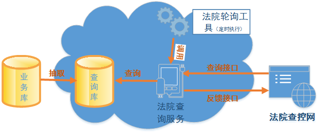
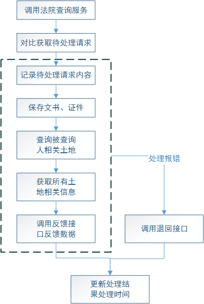

# 概述

根据《关于市法院与市国土局联网查控工作业务需求》所提出的业务需求，以及《人民法院网络执行查控系统与不动产行业查询技术规范》，开发法院查询系统，定时调用法院查询接口，并自动在由一张图业务库抽取形成的法院查询库中查询数据，形成反馈数据，调用法院反馈接口反馈结果。

# 建设内容

### 概述

根据《人民法院网络执行查控系统与不动产行业查询技术规范》，制作法院轮询工具，定时执行，调用法院查询服务；查询服务调用法院查询数据接口，获取法院要查询的数据以及相关的文书和法官证件信息，自动在法院查询数据库中查找匹配的信息，形成反馈信息，并调用法院反馈接口反馈查询结果；而查询数据及相关的文书和法官证件信息则在法院查询数据库中保存，文书和法官证件文件则保存在本地文件系统中的指定位置，作为日志信息；若在处理过程出现错误，则调用法院退回接口退回请求；最后将处理结果和处理时间保存在数据库中。这里的法院查询数据库与一张图业务库独立，数据由数据抽取工具从业务库中抽取，如下：

### 数据抽取工具

根据法院反馈接口的要求，所需反馈的数据为土地登记、抵押、查封信息，核对所需反馈的字段与业务库字段的对应关系之后（字段对照表见附录I）开发数据抽取工具，将反馈字段与查询字段对应的数据抽取到法院查询库，首次抽取将历史数据全部抽取到法院查询库中，然后每天执行增量抽取，根据“是否外网公示”选项来判断是否抽取，责任处室可以在案件审批过程中决定案件数据是否抽取到法院查询库。

### 法院查询服务

法院查询服务调用法院查询接口，根据查询字段在法院查询库中查询对应记录，并调用反馈接口反馈结果（法院接口详情见附录II）具体查询流程如下：

-   法院查询服务调用法院查询接口，获取司法查询请求内容，与数据库中已处理的法院查询信息对比，并根据指定的处理数据条数获得待处理查询数据

-   根据待处理查询数据中的查询请求单号获取相关文书信息、法官证件信息，并将信息保存在数据库中，文书、法官证件的具体文件则保存在本地文件系统中的指定位置

-   司法查询请求内容中可用于查询的字段包括被查询人姓名、证件类型、被查询人证件/组织机构代码，根据这些字段在法院查询库中查询被查询人所拥有的土地地号

-   根据土地地号查询每块土地相关的土地登记、抵押、查封信息，形成反馈结果，调用法院反馈接口反馈数据，反馈接口返回信息作为处理结果

-   若在处理过程中出现错误，则调用法院退回接口退回请求，并将返回信息作为处理结果

-   利用返回的处理结果，更新查询库中对应查询请求记录的处理结果和处理时间字段

法院查询服务对外开放Web API接口，提供调用查询流程的功能，并且可以通过传入的参数不同来控制每次查询服务所处理的法院查询请求个数。

### 法院轮询工具

用于调用法院查询服务的小工具，主要功能是调用查询服务，启动查询流程，设定定时执行；并且可以通过配置控制每次处理的查询请求个数。