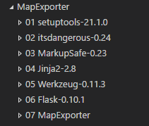
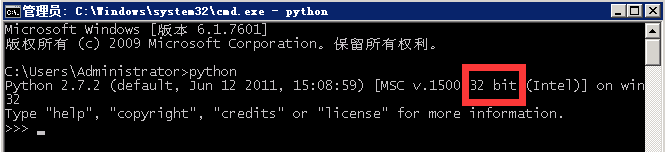

# 安装说明

## 环境要求

- ArcGIS Desktop 10.1
- python 2.7（安装ArcGIS时自带）
- MapExporter安装包，目录结构如下

## 安装

### 环境变量设置

检查PATH环境变量中是否存在Python路径，**推荐使用32位的Python**，若在安装ArcGIS时没有指定python的安装目录，32位的安装目录应该是**C:\Python27\ArcGIS10.1**，64位python的安装目录为C:\Python27\ArcGISx6410.1，这里使用`C:\Python27\ArcGIS10.1`    

设置完成后打开`cmd`直接数据`python`回车，若设置成功则输出如下，注意位数    

### Flask及相关组件安装

打开`cmd`窗口，切换到MapExporter所在的文件夹，安装01-06文件内的python包，

 1. 首先切换到MapExporter所在文件夹 `cd [MapExporterFolder]`
 2. 安装`setuptools`：
    - `cd "01 setuptools-21.1.0"`
    - `python setup.py install`
    - `cd ..`
 3. 安装`itsdangerous`:
    - `cd "02 itsdangerous-0.24"`
    - `python setup.py install`
    - `cd ..`
 4. 安装`MarkupSafe`:
    - `cd "03 MarkupSafe-0.23"`
    - `python setup.py install`
    - `cd ..`
 5. 安装`Jinja2`:
    - `cd "04 Jinja2-2.8"`
    - `python setup.py install`
    - `cd ..`
 6. 安装`Werkzeug`:
    - `cd "05 Werkzeug-0.11.3"`
    - `python setup.py install`
    - `cd ..`
 7. 安装`Flask`:
    - `cd "06 Flask-0.10.1"`
    - `python setup.py install`
    - `cd ..`
 