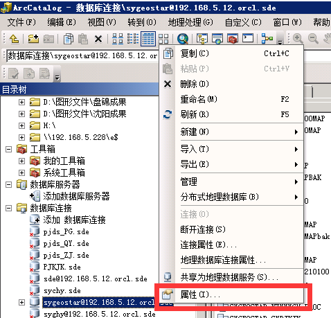
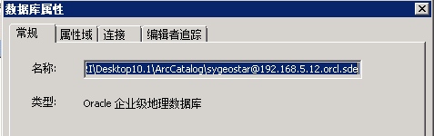

# 配置说明

配置文件位于`07 MapExporter/config.py`，主要用于配置图形工作空间和导出位置映射关系，内容如下：

```
WORKSPACE = r'C:\Users\Administrator\AppData\Roaming\ESRI\Desktop10.1\ArcCatalog\sygeostar@192.168.5.12.orcl.sde'
LOG_FILE = 'export.log'
PATH_MAPS = {
    "Results": "D:/MapServiceExporter",
    "E:": r"\\192.168.5.228\e$"
}
```

这里需要配置的是WORKSPACE和PATH_MAPS对象

## WORKSPACE配置

此变量是指arcpy在运行时所使用的工作空间，与ArcToolBox中的工具运行时的工作空间相同    

这里配置应该是所要导出数据的SDE连接文件，具体文件位置可以在ArcCatalog中查找，如下：  

  



使用这里SDE连接文件作为WORKSPACE的值即可，替换文件中两个单引号之间的值即可

## PATH_MAPS配置

PATH_MAPS是一个字典变量，是指导出shape文件路径的映射关系，用于处理输入请求中指定的shape文件输出路径的`outputfolder`参数，将`outputfolder`参数中字典`key`值替换为对应的`value`值，根据上述配置， 例如：`outputfolder=E:\Output`会被处理成`outputfolder=\\192.168.5.228\e$\Output`