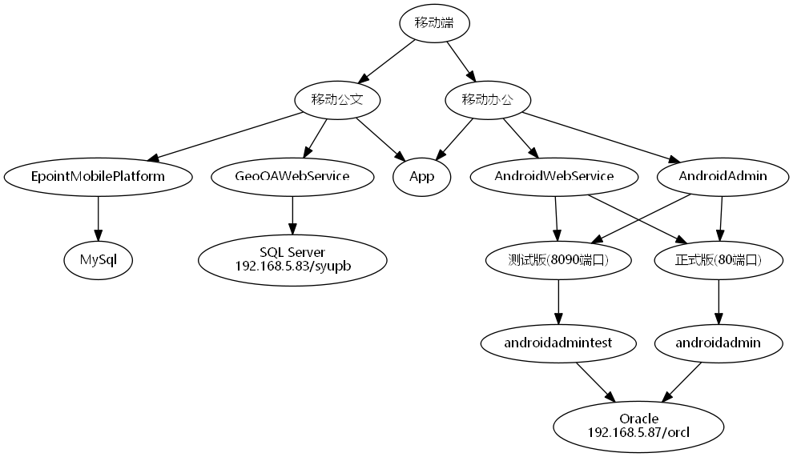

# 移动端

## 服务器说明
移动端后台服务器，移动端包括两个APP：移动办公（公司移动端开发人员开发），移动公文（国泰新点软件公司开发），对应的移动端后台应用共四个：

 - **移动办公**：
    + 后台服务接口：用于移动办公app获取相应配置及数据的接口（公司移动端开发人员开发）
    + 后台管理系统：用于数据录入（沈阳办事处开发人员开发）
    
     
 - **移动公文**：
    + 国泰新点中间平台：移动公文配置接口（国泰新点软件公司开发），此地址写死在app中，不可修改
    + 后台服务接口：用于公文数据的获取（沈阳办事处开发人员开发）
    
> 注：  
> 国泰新点当时给留下了一个部署文档，位置在:\192.168.5.84\d$\Epoint\沈阳国土规划局移动平台部署实施指南.doc
    


## IIS应用说明

| 地址 | 说明 |
| ---- | --- |
| 192.168.5.84/AndroidWebService | 移动办公后台服务接口正式版 |
| 192.168.5.84:8090/AndroidWebService | 移动办公后台服务接口测试版 |
| 192.168.5.84/AndroidAdmin | 移动办公后台管理系统正式版 |
| 192.168.5.84:8090/AndroidAdmin | 移动办公后台管理系统测试版 |
| 192.168.5.84/GeoOAWebService | 移动公文后台服务接口 |

> **注：**  
> 移动公文-国泰新点中间平台为tomcat应用，地址为192.168.5.84:8080/EpointMobilePlatform，用户名：admin，密码：11111
> 对应的目录为\192.168.5.84\c$\apache-tomcat-7.0.57_Windows_64bit\webapps\EpointMobilePlatform

## 数据库说明

移动端公文后台使用的是mysql数据库，而移动办公后台使用的是Oracle数据库，数据库皆安装在\192.168.5.87\d$目录下，分别为app和mysql目录；  

其中移动办公数据库数据库实例名为orcl，有正式和测试两套数据，用户名分别为androidadmin和androidadmintest，密码则与用户名相同


## 移动公文app自动更新配置

**apk路径：**\192.168.5.84\c$\apache-tomcat-7.0.57_Windows_64bit\webapps\EpointMobilePlatform\mobileconfig\updateclient\android_phone.apk  

**版本配置文件路径：**\192.168.5.84\c$\apache-tomcat-7.0.57_Windows_64bit\webapps\EpointMobilePlatform\mobileconfig\updateclient\update_androidphone.xml

更新步骤：

 1. 将新的apk安装包命名为android_phone.apk，放到apk路径中覆盖
 2. 修改版本配置文件中的version节点为相应的版本号：
 ```
 <version>5.1.6</version>
 ```   
 > 注：确保版本配置文件中updateurl节点中配置的url输入到浏览器中可以下载到文件
 
## 移动办公app自动更新配置

**apk路径：**\192.168.5.84\d$\Android.Test\webservice\apk\GeoLeaderMap.apk

**版本配置文件路径**：\192.168.5.84\d$\Android.Test\webservice\config.xml

更新步骤：

 1. 将新的apk安装包放到apk路径中覆盖
 2. 修改版本配置文件中的update节点的version属性为相应的版本号，path为相应的apk文件url路径
```
<update version="2.5" path="http://192.168.5.84:8090/AndroidWebService/apk/GeoLeaderMap2.5.apk" description="最新版，更新UI"></update>
```
> 注：确保版本配置文件中update节点path属性中配置的url输入到浏览器中可以下载到文件

    