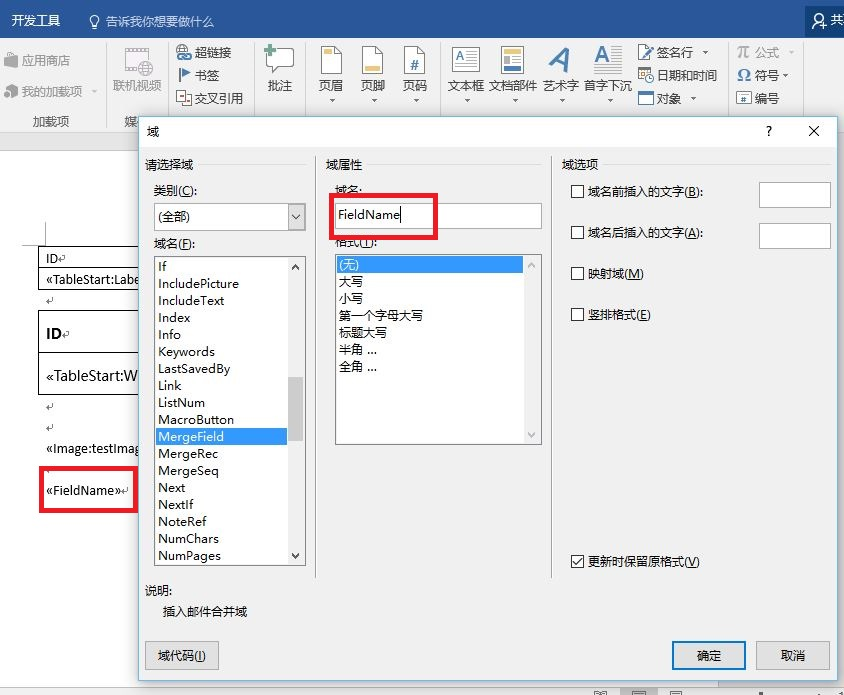

# Excel配置

---

## 节点说明

```
<output ...>
  <varmarkers>
    <varmarker name="" value="" />
    ...
  </varmarkers>
  <arraymarkers>
    <arraymarker name="" split="," value="" />
    ...
  </datasetsqls>
  <datatablemarkers>
    <datatablemarker name="" conn="" sql="" />
    ...
  </datatablemarker>
</output>
```

 - `varmarkers/varmarker`: 模板文件中单一变量对应的配置
 - `arraymarkers/arraymarker`: 模板文件中数组变量对应的配置
 - `datatablemarkers/datatablemarker`: 模板文件中表格数据对应的配置


---


## 单一变量配置

### 模板配置

在Excel的单元格中输入`&=$name`即可，其中的name为变量值，即在节点中配置的name值

### 节点配置

`varmarkers`下配置一个或多个`varmaker`节点，每个`varmarker`节点配置一个单一变量名和变量值

| 属性名称 | 默认值 | 属性说明 |
| ------- | ------ | ------- |
| name | `null` | 单一变量名，对应模板中配置的`&=$name` |
| value | `null` | 单一变量值，可以内嵌入数据源中的参数，以`${字段名}`的方式可以将数据源中对应的字段值替换到变量中 |

---


## 表格配置

### 模板配置

在Word菜单栏`插入`--`文档部件`--`域`，弹出域窗口，域名列表中选择`MergeField`，在域名中填写对应的域名，确定后会在光标位置插入一个为`《域名》`的域
  


**在Word菜单中插入表格**，以域名为`《TableStart:表名》`为表格的开始，`《TableEnd:表名》`为表格的结束，`《列名》`为每一列的对应的字段名，其中表名对应`datatablesql[@tablename]`属性，列表对应SQL语句查询结果中的字段名，如下图  
  


### 节点配置

`datasetsqls`下配置一个或多个`datatablesql`节点，`tablename`属性配置表名，对应模板中的域名中的表名，其下配置SQL语句，取`instancesql`查询结果记录作为sql参数


---


## 图片配置

### 模板配置

Word中同样是配置域，只不过域名配置为`《Image:图片名》`，图片名字段可以对应`images/image[@name]`属性值  

### 节点配置

`images`下配置一个或多个`image`节点，`type`属性可以配置`path`和`sql`

 - `type`属性配置为`path`时，配置对应的`name`和`value`属性，`name`为图片名对应模板中域名，`value`属性值为图片文件的位置
 - `type`属性配置为`sql`时，配置对应的`value`属性，`value`属性值为对应的Sql语句名，从数据库中取图片数据，未测试


