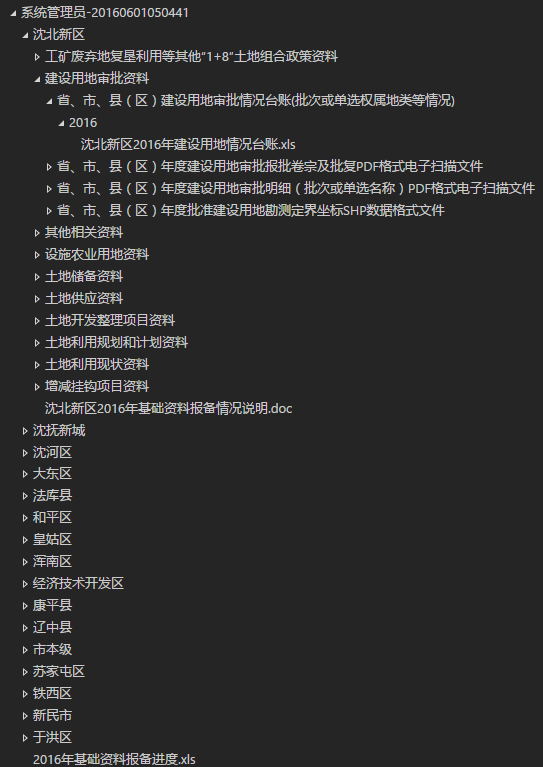

# 概述

PackagerService作为基础数据提报系统（督察局数据报备系统）的打包服务所开发，提供根据配置将数据库中的数据导出到磁盘上指定位置，并以配置的目录结构来组织导出结果，如图所示  

可以导出的内容包括：
 - 使用数据库中的数据根据Word模板导出Word文档，如承办单、通知书等
 - 使用数据库中的数据根据Excel模板导出Excel文档，如案件明细、台账等
 - 直接在数据库中以二进制形式存储的附件数据
 - 通过调用图形服务导出图形shape文件
 - `iWebOffice`插件所编辑的Word文档，如发文文稿等