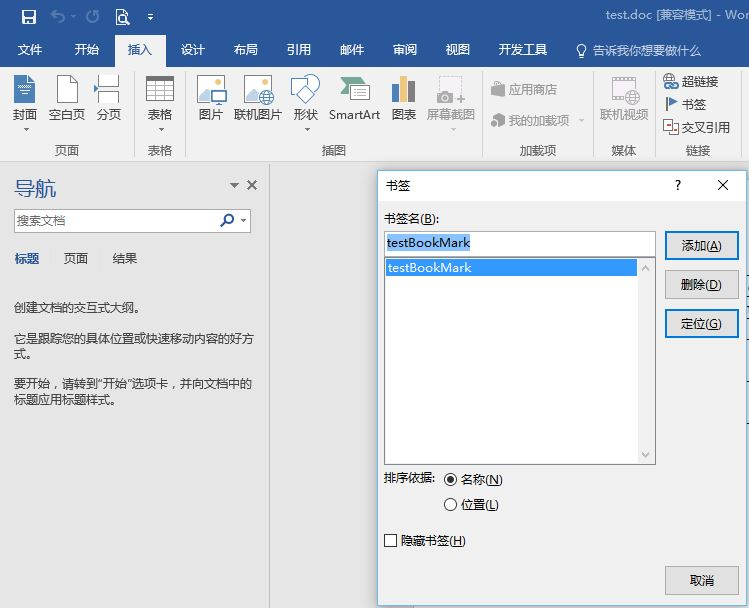

# Word配置

# 节点说明

Words--Word--bookmarksqls/bookmarksql--datasetsqls/datatablesql--images/image

 - bookmarksqls/bookmarksql: 模板文件中书签字段对应的查询语句配置
 - datasetsqls/datatablesql: 模板文件中表格数据对应的查询语句配置
 - images/image: 模板文件中图片数据对应的查询语句配置

## 书签配置

### 模板配置

在Word菜单栏‘插入’--‘书签’，插入书签，书签名称对应SQL语句中查询结果字段名  
  

### 节点配置

bookmarksqls下配置一个或多个bookmarksql节点，每个bookmarksql节点配置一个SQL语句，取instancesql查询结果记录作为sql参数

## 表格配置

### 模板配置

在Word菜单栏‘插入’--‘文档部件’--‘域’，弹出域窗口，域名列表中选择‘**MergeField**’，在域名中填写对应的域名，确定后会在光标位置插入一个为"《域名》"的域
  

在Word菜单中插入表格，以域名为“《TableStart:表名》”为表格的开始，“《TableEnd:表名》”为表格的结束，“《列名》”为每一列的对应的字段名，其中表名对应DataTableSql[@tablename]属性，列表对应SQL语句查询结果中的字段名，如下图  
  
[[/Configuration/Word_Table.jpg]]

### 节点配置

DataSetSql下配置一个或多个DataTableSql节点，tablename属性配置表名，对应模板中的域名中的表名，其下配置SQL语句，取instancesql查询结果记录作为sql参数

## 图片配置

### 模板配置

Word中同样是配置域，只不过域名配置为“《Image:图片名》”，图片名字段可以对应Images/Image[@name]属性值  

### 节点配置

Images下配置一个或多个Image节点，type属性可以配置path和sql

 - type属性配置为path时，配置对应的name和path属性，name为图片名对应模板中域名，value属性值为图片文件的位置
 - type属性配置为sql时，配置对应的value属性，value属性值为对应的Sql语句名，从数据库中去图片数据，未测试

