# UCML软件安装

* 安装UCMLSetup20070718.msi
* 安装加密狗驱动

> 1. 安装系统必须是Windows XP系统
> 2. 加密狗驱动必须安装，否则无法识别U盘加密狗

# UCML配置

1. 启动**开始-&gt;所有程序-&gt; UCML 企业级应用框架平台-&gt;UCMLSRV.exe**

2. 配置项目，在任务栏右下角双击**UCMLSRV**，打开_项目配置_页面

  这里主要配置开发库地址，配置完成后单击**确定**，然后重启**UCMLSRV.exe**，在启动UCML程序前，需要插入 Mircodog（U盘加密狗）

  > 注：UCML使用完毕后需要关闭**UCMLSRV.exe**，否则机器不能正常关机

3. 打开桌面上的**UCML 企业级应用框架平台 for Asp.Net**，在下图中输入**UCMLSRV服务的地址**，用户名为`ADMIN`，密码为空

4. 在弹出的主界面中有两个配置需要注意的地方：

  1. **本地设置信息-&gt;C\#源代码路径**，配置导出的数据层（DBModel）和工作流（WorkFlow）的源码
  2. **数据库连接设置**，这里配置工作流定义信息、报表定义信息等导出的位置  
    

# 制作工作流操作步骤

### 1. 新建工作流

主要以现有项目为例（就是维护），右键**沈阳规管**，在弹出的菜单中点击**添加子项目包**  

右键新添加的子项目包，单击**工作流管理**新建_工作流管理_节点  
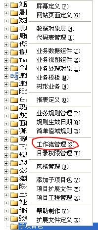

### 2. 创建工作流模型

系统会根据创建的工作流完成业务，在上一环节添加的_工作流管理_节点上右键，选择**添加工作流模型**  
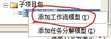

### 3. 绘制工作流模型

单击刚刚添加的工作流模型，右边则显示出对应的模型绘制界面  
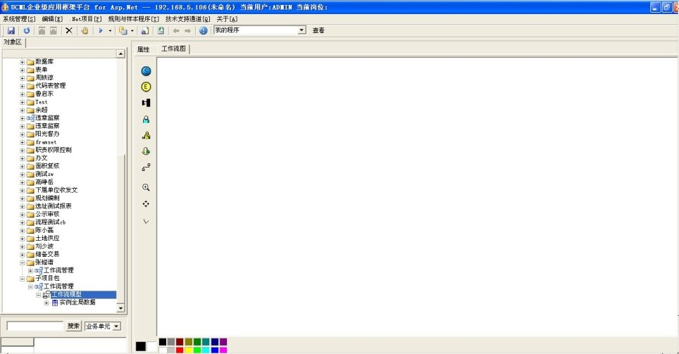  
每个流程都需要一个开始和结束环节
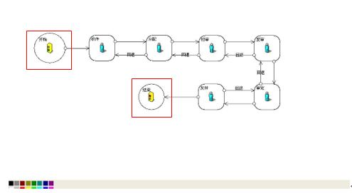
绘制流程工具条如下  
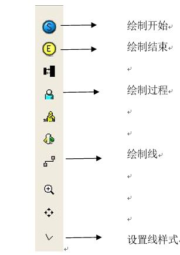

### 4. 回调函数的设置

流程中的每个步骤都需要设置回调函数，在环节的属性标签中勾选**使用回调函数分配任务**  
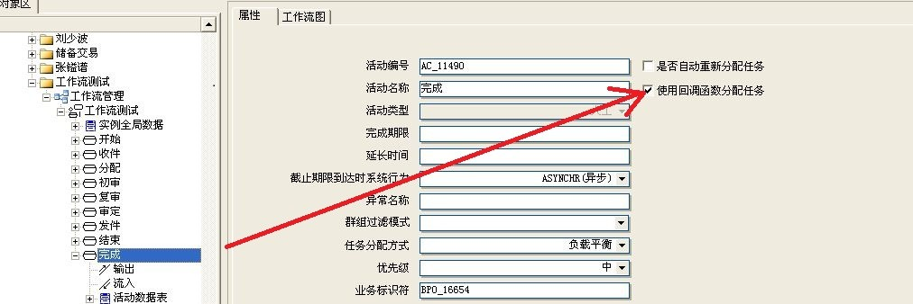

> 注：若勾选了**是否自动重新分配任务**，在运行流程时会提示如下错误：
> 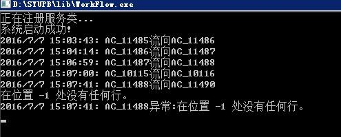

这里的每个环节需要配置的回调函数为`wm_assign`\/`wm_afterAssignTask`\/`wm_beforeAssignTask`\/`wm_afterTaskFinish`，可以从现有的流程中拷贝对应的函数内容即可，一般流程中_初审、复审、审定、批准_环节的回调函数相同

# 导出工作流

导出工作流步骤如下  
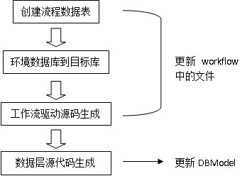

### 文件夹组织结构

导出工作流文件夹（在**UCML配置**中配置的**C\#源码路径**）组织结构如下：
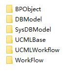

### 导出具体步骤

1. **创建流程数据表**，右键工作流模型创建流程数据表，这一步会在目标数据库（在**UCML配置**中配置的导出数据库位置）中创建流程和环节表（形如：`Flow_XXX`,`AC_XXX`）
  

2. **导出工作流定义信息**，选择菜单栏中**.NET项目-&gt;环境数据到目标库-&gt;工作流定义信息**，等待弹出“导出完成”提示（耗时）  
  

3. **数据层源码生成**，选择菜单栏中**.NET项目-&gt;数据层源码生成\(step 2\)**，这里源码会生成到`C#源码路径/DBModel`中 
  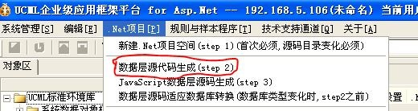

4. **工作流驱动源码生成**，右键_工作流模型_，选择_工作流驱动源码生成_，这里源码会生成到`C#源码路径/WorkFlow`中 
  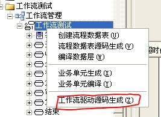

> 注： 在执行**数据层源码生成**和**工作流驱动源码生成**步骤时会不停的报错，一路单击回车忽略即可

完成以上四步之后，新创建的流程代码分别更新到了`DBModel`和`WorkFlow`文件夹下，流程相关信息则导出到了目标数据库中

# 工作流模型的使用

### 编译

首先在DBModel和WorkFlow的项目中包含本次新建的流程、环节、连接线源码文件。编译DBModel生成DBLayer.dll，编译WorkFlow生成WorkFlow.exe执行程序，编译WorkFlow过程中需要DBLayer.dll，所以需要先编译DBLayer.dll再编译WorkFlow，注意WorkFlow项目中DBLayer应指向最新的DBLayer.dll

### 数据库配置

在GeoCaseType表中需要手动添加一条记录来表示新增的流程，表中的FlowType字段表示事项类型，`1`表示规划审批事项，`2`表示国土审批事项

### 系统配置

1. **工作流权限配置**， 配置工作流中每个环节所对应的角色列表  

2. **工作流角色配置**， 配置工作流中所有出现角色的列表及顺序，在流程图界面显示时需要  

3. **工作流并联周期配置**， 添加一条新的并联模板并配置对应的周期信息  

4. **工作流权限配置**， 配置流程基本信息及相关业务表格和分局经办配置

# 常见问题

1. FlowType  
 a. GeoCaseType中的FlowID字段值“FLow_10179”中的`FL`必须大写  
 b. 在配置GeoCaseType表时，CaseName不能重名  

2. 在设置流程线，当有“转移条件脚本”时，“是否条件”需要勾选，“转移条件脚本”才会生效，负责流程环节的进退  
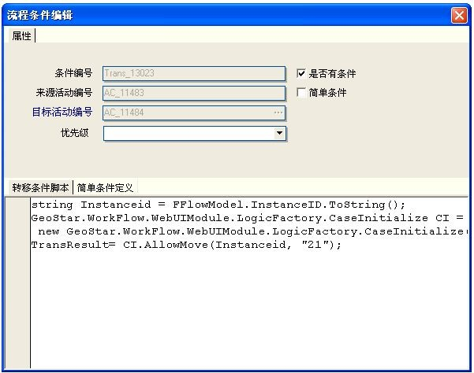

3. 问题如下  
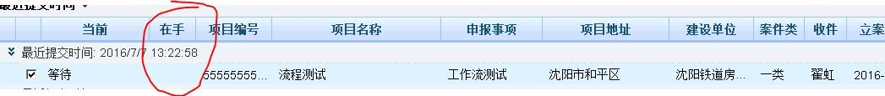
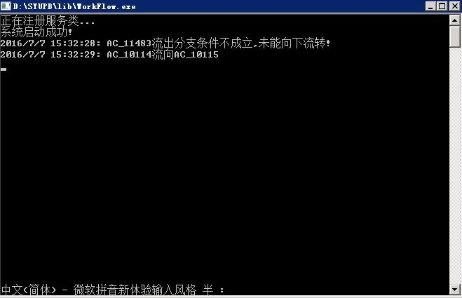

流程分支错误，只能找到线，线上的条件为false，有可能的原因是线上的条件不对

