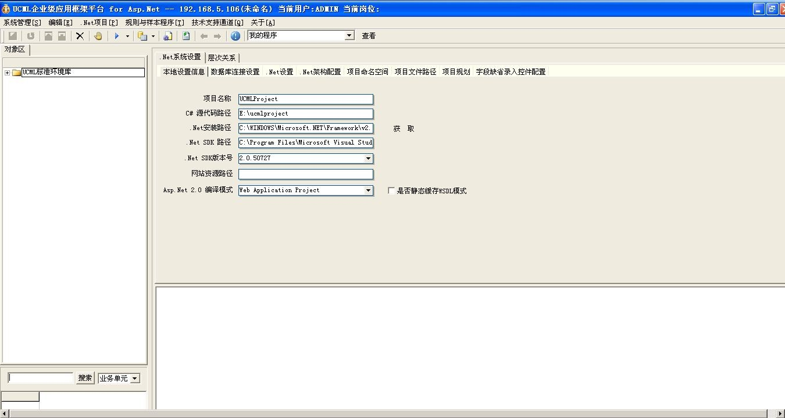
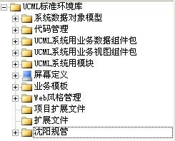

# UCML软件安装

* 安装UCMLSetup20070718.msi
* 安装加密狗驱动

> 1. 安装系统必须是Windows XP系统
> 2. 加密狗驱动必须安装，否则无法识别U盘加密狗

# UCML配置

1. 启动**开始-&gt;所有程序-&gt; UCML 企业级应用框架平台-&gt;UCMLSRV.exe**

2. 配置项目，在任务栏右下角双击**UCMLSRV**，打开_项目配置_页面

  这里主要配置开发库地址，配置完成后单击**确定**，然后重启**UCMLSRV.exe**，在启动UCML程序前，需要插入 Mircodog（U盘加密狗）

  > 注：UCML使用完毕后需要关闭**UCMLSRV.exe**，否则机器不能正常关机

3. 打开桌面上的**UCML 企业级应用框架平台 for Asp.Net**，在下图中输入**UCMLSRV服务的地址**，用户名为`ADMIN`，密码为空

4. 在弹出的主界面中有两个配置需要注意的地方：

  1. **本地设置信息-&gt;C\#源代码路径**，配置导出的数据层（DBModel）和工作流（WorkFlow）的源码
  2. **数据库连接设置**，这里配置工作流定义信息、报表定义信息等导出的位置  
   

# 制作工作流操作步骤

### 1. 新建工作流

主要以现有项目为例（就是维护），右键**沈阳规管**，在弹出的菜单中点击**添加子项目包**  

右键新添加的子项目包，