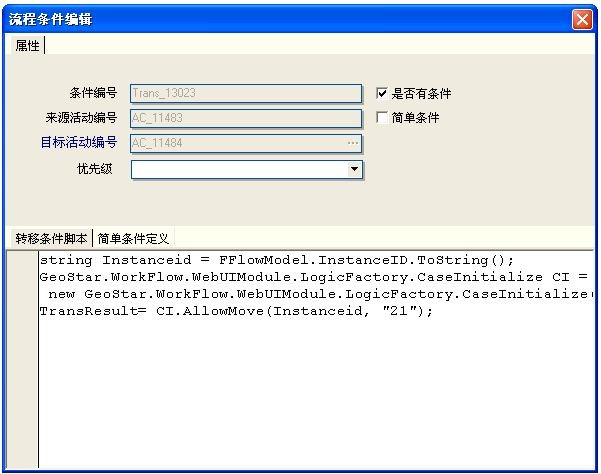
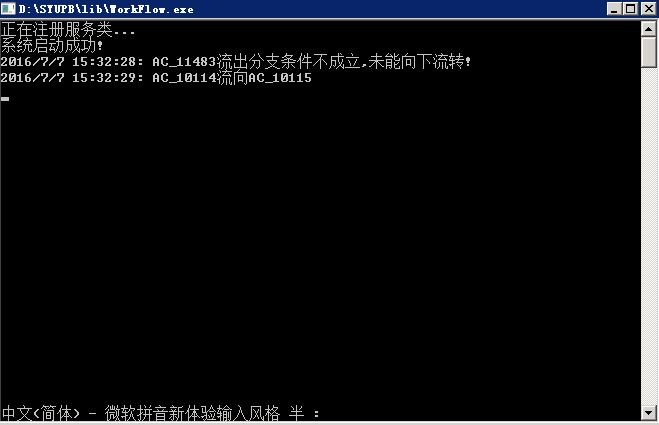

# 常见问题

1. FlowType
 a. GeoCaseType中的FlowID字段值“FLow_10179”中的`FL`必须大写
 b. 在配置GeoCaseType表时，CaseName不能重名

2. 在设置流程线，当有“转移条件脚本”时，“是否条件”需要勾选，“转移条件脚本”才会生效，负责流程环节的进退

3. 问题如下

流程分支错误，只能找到线，线上的条件为false，有可能的原因是线上的条件不对