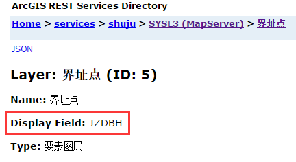

# Q&A

## 用户反映找不到件了（多为公文）

> `Q:` 经常会有用户反映找不到案件的情况，如公文选择了某个办理人，办理人却没有收到，或者文员录入件之后提交给办公室主任，却没有收到
> 
> `A:` 这种情况多为中间表没有刷新的情况，对于选择办理人却没有收到的情况，可以先尝试重新选择办理人再删除意见，如果不好使，则需要去对比中间表和对应的视图，中间表可以在后台`系统配置`->`系统主页面配置`->`[对应的节点SQL语句]`中找到，一般对应的视图都是相应的中间表去除表字段，如果中间表和视图不一致，则需要刷新中间表，刷新中间表的语句可以在代码中找到：业务审批对应语句可以在`LogicFactory/GeoTempTable.cs`中找到；行政办公对应语句可以在`LogicFactory/GeoCommonWord.cs`中找到。若是中间表和视图一致，则可能是流程处理时某些表的数据没有插入，具体需要分析对应视图中所涉及的表是否缺少记录，一般包括`TaskTicket`, `AssignTask`, `FlowModeRoleInstance`, `GeoFlowInstCyc`，分别为环节表、环节对应人员分配表、人员分配角色表、环节周期表，皆与实例相关，**此操作较复杂，需要清除表关系后操作**，最后仍需刷新中间表，这种情况也可以选择重新录入。

## 公文系统来文节点显示“超时时间已到...”

> `Q:` 杨潇冰打开公文系统，公文系统左侧列表树加载缓慢，加载出来之后来文节点显示“超时时间已到。在操作完成之前超时时间已过或服务器未响应。”
>
> `A:` 数据库死锁问题，而且是应用程序中的死锁，其实如果将查询来文未办、已办数量的语句直接拿到数据库中执行的话是可以执行成功的，但是由于找不到程序死锁的位置，仅能提供解决办法：`关闭IIS` -> `关闭WorkFlow` -> `关闭数据库` -> `启动数据库` -> `启动WorkFlow` -> `启动IIS`

## 同一流程根据不同的事项和注册时间配置表单

> `Q:` 同一流程（FLowID相同）的不同事项（GeoCaseType不同），如何配置不同的表单？
> 
> `A:` 流程表单的配置在 `系统配置 -> 案件办理框架配置` ，最初这里的表单配置是根据流程中的环节来配置的，并不能根据事项来区分，在多规合一制作过程中进行了修改，可以根据事项和注册时间来配置，主要是通过 `Forms/Form[RegisterTime/CaseCode]` 来配置
> - `RegisterTime` 根据立案时间来控制表单的显示，如果没有这个属性，则默认都显示，形如 "开始时间-结束时间"，如：“2017/01/01-” （注意，`-` 不可以省略）说明从 2017/01/01 开始立案的件都显示当前表单，“-2017/01/01” 表示到 2017/01/01 立案的件显示当前表单，“2016/01/01-2017/01/01” 表示 2016/01/01 到 2017/01/01 立案的件显示当前表单，**注意：这里时间中的年月日使用 `/` 分割，不可以使用 `-` 
> - `CaseCode` 根据事项代码来控制表单的显示，如果没有这个属性，则默认都显示，可以配置多个事项代码，分隔开即可，分隔符随意，如 “hbyd” 表示划拨用地事项显示当前表单

## 局长退回案件在办箱丢件

> `Q:` 案件由分管局长（审定环节）提交到局长手（批准环节），分管局长和局长都能看到这个件，但是局长将这个案件退回到分管局长手时，分管局长能够看到，但是局长的在办箱却没有案件了，流程也正常。。。  
>   
> `A:` 这个原因应该是审定环节没有配置对应的“扩展人”，因为在局长将案件退回到分管局长手时，局长对于当前环节来说，角色是扩展人，若是没有配置则没有对应的分配（AssignTask）记录，可以在`系统配置->工作流权限配置`中为相应的环节（审定）添加扩展人角色，再次退回案件，局长在办箱也可以看到相应的案件

## 入库更新系统`Network I/O error`

> `Q:` 勘测院入库更新系统在进行数据检查时报错`Network I/O error`，而且在ArcCatalog 10.0中预览500地形图中的图层，来回切换，也会出现`Network I/O error[SDE.GDB_UserMetaData]`错误  
>   
> `A:` 这个是由于数据库里数据有问题导致的错误，将数据库里的要素类拷贝到本地GDB文件地理数据库中，执行ArcToolbox中`数据管理工具--要素--修复几何`工具对每一个图层进行修复，会删除要素类中有问题的数据，如：图形为空的数据等，之后再将修复完成的数据拷贝回数据库中即可

## 案件报建人、报建单位查询

> `Q:` 报建人、报建单位与案件`InstanceID`的关联关系是怎样的？怎样使用`InstanceID`获取到报建单位电话和报建人电话  
>   
> `A:` 关联关系如下：
> 
> ```sql
> GeoGGFlowInstance b
> left join GeoGGProject c
>   on c.InstanceID = b.FolderID
> left join GeoGGProjBuildCo d
>   on d.InstanceID = b.FolderID
> left join GeoExterUnit e
>   on e.GeoExterUnitOID = d.GeoExterUnit_FKOID
> left join ApplyPersonInfo f
>   on f.GeoGGProYDBaseInfoTableOID = c.GeoGGProjectOID
> left join GeoPersonInfo g
>   on g.IDCard = f.IDCard
> ```
> 
> 其中`GeoExterUnit`表为报建单位项目信息表
> `GeoPersonInfo`表为报建人信息表

## 附件管理界面点击`文件上传`按钮报错或没反应

> `Q:` 附件管理界面，点击`文件上传`按钮，没有弹出附件上传的界面
>
> `A:` 多为客户端组件注册不成功或IE设置问题导致插件调用失败导致，
> 可以尝试重置IE、重新注册组件等方式解决
>   
> 1. 首先，要确认客户及安装了`.NET Framework 2.0`及客户端，高版本的`.NET Framework`可以存在，但是还是要安装2.0才可以正确注册  
> 2. 重新注册组件，在客户端的安装目录`C:\Program Files\Geostar\SystemRequest`下，找到批处理文件`Reg.bat`(有些机器没有显示后缀名，可能显示为`Reg`)，运行即可执行重新注册  
> 3. 重置IE，重新设置IE设置，设置完后再次打开附件管理页面时，页面上方可能会弹出插件安全性检查之类的提示，右键选择`在所有网站上加载`即可

## 附件管理界面点击`文件上传`报错`此实现不是 windows 平台 fips 验证的加密算法的一部分`

> `Q:` 附件管理界面，点击`文件上传`按钮，弹出如下提示窗口
> 
> 
> `A:` 注册表问题，修复注册表即可
>  - win+r，输入regedit
>  - 定位目录HKEY_LOCAL_MACHINE\SYSTEM\CurrentControlSet\Control\Lsa\FipsAlgorithmPolicy
>  - 修改Enabled的值改为0

## 复制虚拟机之后，授权无法正常读取

> `Q:` 吉奥基础授权服务，原虚拟机中授权可以正常使用，在复制完成虚拟机之后，打开虚拟机，选择“我已复制该虚拟机”选项，打开后导致授权不可使用
> 
> `A:` 复制或移动虚拟机之后，再次打开虚拟机会提示`虚拟机配置已经改变`，然后选择是`我已移动该虚拟机`还是`我已复制改虚拟机`，此时，为保证拷贝后的授权文件可用，即原虚拟机和复制后的虚拟机有相同的机器码，**应选择`我已移动该虚拟机`**

## syupb登录后左边树空白，IE报错"Automation服务器不能创建对象"

> `Q:` 铁西分局郭林反映从内网门户一张图进入系统后一片空白，没有显示左边的树节点，远程到她的电脑后(竟然是Windows Server 2003 >_<|||)，利用syupb的正常登录页面登陆也没有左边树节点，然后左下角页面报错“Automation服务器不能创建对象”
> 
> `A:` 首先怀疑是IE设置问题
>  - 设置信任站点级别，启动所有ActiveX相关项，禁用XSS、Smarter筛选器；
>  - 删除信任站点，重新添加  
>  
>  然并卵！！接着怀疑是客户端组件问题，重装客户端，安装msxml插件，此时发现机器上有360安装卫士运行，乃伊组特！！！然后注销系统重新登录，好使之  
>  
>  总结：怀疑是msxml插件缺失和360安全卫士的问题

## 图形端中i查询结果标题显示为“未知名称”

> `Q:` 图形端中i查询出结果的详细信息界面中字段值皆有，但是弹出的信息窗口的标题为“未知名称”
> 
> `A:` i查询的信息窗口中的字段显示所在层的所有属性数据，
> 其标题取值的字段为所发布的图形服务中的`Display Field`字段值，如下：  
> 
>   
> 可以在MXD中图层属性中编辑显示字段。
> 
> 但是在这个地方有个问题，当我们为字段提供了别名（如字段名称JZDBH，中文别名界址点编号）的时候，`Display Field`值仍为原来的字段名称，这样图形端程序在读取的时候就会出现问题，只能识别别名而不能识别原名称。
> 
> 发现问题后修改程序，支持在配置文件中配置图层要显示的字段名称，
> 在`DataDIR/Layer@DisplayField`属性中设置响应的字段即可，如下：  
> 
> 
> 注： 程序在2016.11.11（是的，没错，就是光棍节）修复，应用于水源地保护展示系统，其他系统皆未更新。