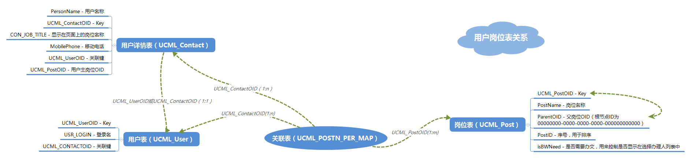

# SYUPB

本文主要讲述 SYUPB 相关的乱七八糟的配置选项

## 坐标导入配置

坐标导入作为一个单独页面使用，
在后台配置中为相应的案件配置对应的坐标导入按钮，
然后进行如下配置即可。

### 导入图层配置

坐标导入的图层参数配置位于 12/13 图形库，执行如下语句：

```
select 参数 from A00GIS_图形模块运行参数表 where 参数ID = '60201'
```

其中参数为 blob 类型的 xml 数据，在其中添加对应事项和图层的配置即可，如下：

```
<hbyd>划拨用地</hbyd>
```

表示 `hbyd` 事项坐标导入对应的图层为 `划拨用地`

### 导入属性配置

坐标导入的图形属性，在导入时一同导入，
具体的配置文件为 `D:\syupb\BPObject\Resource\CoorImportAttr.xml` ，
文件中用于配置导入时获取图形属性所用的 SQL 语句，
每一个 query 节点对应一个事项的 SQL 语句，属性如下：

 属性名称 | 说明 
 -------- | -------
 ProcAb | 案件编码，如：`hbyd`；可以使用正则表达式匹配，如 `.*` 表示匹配所有
 CaseType | 案件事项，如：`划拨用地`；可以使用这则表达式匹配
 ParentPage | 调用坐标导入页面的父页面名称，现可取： GeoTransactCase.aspx （业务审批）和 ResultCase.aspx （数据汇交）

> **注：** 这里会自上而下的遍历配置，并且取匹配到的第一个 query 配置，
> 故在配置的时候，通配的配置 `.*` 应该放在同类配置的最后面。

如，要在业务审批中划拨用地事项的页面上配置坐标导入功能，做如下配置：

```
<query ProcAb="hbyd" CaseType="划拨用地" ParentPage="GeoTransactCase.aspx">
    SELECT '{0}' 案件编号, 'HBYD' AS CaseCode, '划拨用地' AS CaseName, '{1}' AS UserID
</query>
```

上述中配置的 SQL 语句，获取的结果对应的列名为导入图层对应的字段名，
并且在执行查询时会注入两个变量， `{0} -> InstanceID`,`{1} -> UserOID`

## 图形定位配置

在进行坐标导入，图形入库之后，需要在业务审批案件中进行图形定位，
进行如下配置：

### 图形服务配置

业务审批对应的图形配置文件在 `D:\syupb\BPObject\NJGIS\flex\appCfg_Case.xml` 
（其实，图形端对应的配置文件都可以通过 fiddler 抓包来查看）  
  
 - 在 `configuration/mapServiceConfig/systemTree` 下添加 `Service` 节点，
   配置对应的地图服务地址

   ```
   <Service ServiceID="划拨用地" Type="Dynamic" URL="http://192.168.0.1/arcgis/rest/services/DGHY/HBYD/MapServer">
        <Layer IndexNo="0" LayerName="划拨用地" />
      </Service>
   ```

   * `ServiceID` 服务唯一标识，在文件中不能重复
   * `Type` 服务类型，这里配置 `Dynamic` 表示矢量图层
   * `URL` 服务地址
   * `Layer/IndexNo|LayerName` 为服务下图层的索引和名称，需与服务中的一致

 - 在 `configuration/mapServiceConfig/serviceTree` 下添加 `Service` 节点，
   配置对应的服务树，其中 `ServiceID` 对应 `systemTree` 中的服务 ID

   ```
    <Service ServiceKey="划拨用地" Name="划拨用地">
        <ServiceInfo Scale="Default" ServiceID="划拨用地"/>
    </Service>
   ```

 - 在 `configuration/mapServiceConfig/libTree` 下添加对应的目录结构，
   用于在图形端图层控制界面显示

   ```
    <DataDIR NodeText="划拨用地" NodeKey="7C3A9A8C-D7E0-47B1-9455-B9554B37F325" Expand="0" isLib="true" Load="0" ServiceKey="划拨用地">
	    <Layer NodeKey="BEB4D8B1-6A4A-4EBA-954C-005DB2689D4D" NodeText="划拨用地" Load="0" Expand="0" LayerName="划拨用地" LayerDefinition="">
	    </Layer>
    </DataDIR>
   ```

   * `NodeText` 图层控制中显示的文本名称
   * `NodeKey` 对应的节点唯一标识，在配置文件中唯一，一般为 GUID
   * `Load` 是否默认加载， 0 表示不加载
   * `ServiceKey` 对应 `serviceTree` 下的服务标识 `ServiceKey`
   * `LayerName` 对应 `systemTree` 下的 `LayerName`

至此，便可以在图形端中的图层控制中显示出刚刚配置的图层了

### 图形定位配置

在 `configuration/configs/OpenMaps` 下添加 `OpenMap` 节点，
用于开图配置

```
<OpenMap>
    <MapService serviceKey="划拨用地">
        <MapLayer layername="划拨用地">
            <item content="案件编号='%val%'"/>
        </MapLayer>
    </MapService>
    <ShowMap NodeKey="BEB4D8B1-6A4A-4EBA-954C-005DB2689D4D"/>
    <Step name="划拨用地"/>
    <Menu name="划拨用地"/>
</OpenMap>
```

 - `serviceKey/layername` 为之前图形配置中的服务标识和图层名称
 - `item[content]` 为查询时使用的 where 条件，一般按照案件编号查询，
   传入的 val 为案件的 InstanceID
 - `ShowMap[NodeKey]` 为之前配置的 `Layer[NodeKey]` ，
   用于配置定位时要显示的图层
 - `Step[name]/Menu[name]` 配置事项名称

## 用户岗位关系图

